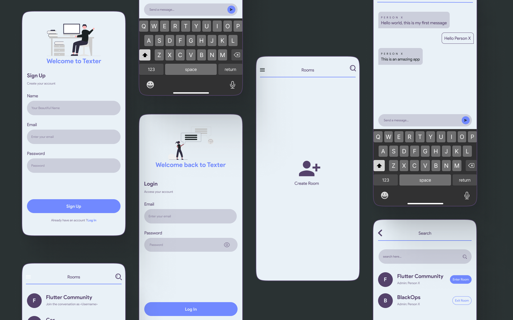

# Texter the Chat Application

The Texter chat application is built with Flutter using Firebase as a backend.


## Prototype Screenshots
<p align="center"> </p>

## UI Guide
<p align="center"> </p>

## Environment Variables

To run this project, you will need to add the following Extensions to your VS code

`Pubspec Assist`

It will give you the ability to add all the packages from VS code windows only

## Dependencies
1. Firebase Authentication
```
flutter pub add firebase_auth
```

2. Cloud Firestore
```
flutter pub add cloud_firestore
```

3. Firebase Core
```
flutter pub add firebase_core
```

4. Flutter Screen Util
```
flutter pub add flutter_screenutil
```

5. Flutter SVG
```
flutter pub add flutter_svg
```

6. Keyboard dismisser
```
flutter pub add keyboard_dismisser
```

7. Shared Preferences
```
flutter pub add shared_preferences
```


## Reference

<a href="https://youtu.be/Qwk5oIAkgnY?t=399" target="_blank"></a>
Firebase Setup

<a href="https://youtu.be/wGOTwojezy8" target="_blank"></a>
How to generate SHA key

<a href="https://www.figma.com/proto/lGF0l5q8iusw6rCtPBDC0q/Chat-App?page-id=0%3A1&node-id=26%3A887&viewport=49%2C324%2C0.26&scaling=scale-down&starting-point-node-id=26%3A887" target="_blank"></a>

## Currently facing problems
- Instead of auto-scrolling to the recent messages, it starts from the beginning when opening the chat page.

## Features I will be adding in Future
- Profile Images.
- Can send files.
- Dark mode and Light mode.
- Instead of displaying a blank page, the search page displays all groups available in the database.

## Feedback
If you have any feedback, please reach out to us at thecubeshade21@gmail.com
